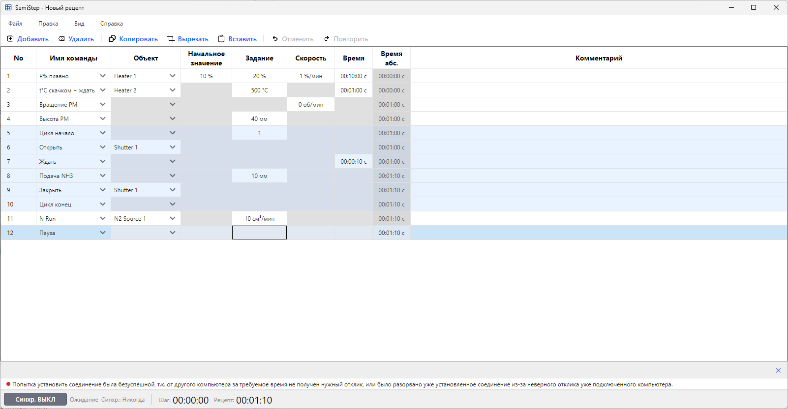

# Error Reporting Contract

How a failed operation reaches the user. Read this before adding a new error-surfacing site.

## The two MessagePanel channels

`MessagePanelViewModel` holds two independent channels that it merges into one `Entries` list:

- **Transient operation channel** (`_operationEntry`). A single slot for the outcome of the most
  recent user-initiated operation. Written through `ReportError` / `ReportWarning` / `ReportSuccess`
  and cleared on the next successful mutation (`ClearOperation`). One operation entry at a time; a
  new outcome overwrites the previous one. Not counted in the panel's error/warning totals.
- **Persistent validation channel** (`_validationEntries`). The structural validity of the *current*
  recipe. Rebuilt wholesale from the recipe snapshot's `IReason` list through `RefreshReasons`.
  These entries drive the status-bar error/warning counts and persist until the recipe changes.

## Ownership

- **Core owns the error text.** Failures are `FluentResults.Result` with typed `IError` reasons; the
  message string lives in Core, never in the UI.
- **The UI only routes.** A view model takes a failed `Result` and hands it to the panel; it does not
  compose error wording beyond an optional operation prefix (e.g. `"Step 3"`).

## The reporting seam

`Result`-to-panel routing goes through `ResultReportingExtensions`
(`SemiStep.UI/MessageService/`):

- `string FormatErrors(this IResultBase)` — joins every error message with `"; "`. The default idiom
  for rendering a failed result, used by both panel sites and log statements.
- `void ReportFailure(this MessagePanelViewModel, IResultBase, string? context = null)` — surfaces
  `FormatErrors()` on the transient operation channel, optionally prefixed with `"{context}: "`.

A failed operation surfaces **all** of its error messages, matching what the log records. Do not
read `Errors[0]` directly.

## Routing rules

- **Transient operation outcomes** (save/load failed, paste rejected, step edit rejected) go to the
  operation channel via `ReportFailure` (or `ReportError` when the message is composed mid-string).
- **Persistent structural state** (the current recipe's validity) goes to the validation channel via
  `RefreshReasons`, and from there to the status-bar counts.
- **PLC connection-loss / sync failures** arrive as a typed `IError` on `IPlcSyncService.Faults`, a
  discrete one-shot channel. `RecipeCoordinator` bridges each fault to the operation channel via
  `ReportError(error.Message)` — the message text is owned in Core. The persistent "disconnected"
  label stays in the status bar.
- **Command exceptions** (a `ReactiveCommand` fault on `ThrownExceptions`) are not `Result`-based;
  they route through `ReportThrownExceptions` (see below) rather than a hand-written handler.
- **One deliberate exception** to the `"; "` idiom: the clipboard *paste* failure lists each error on
  its own line (`Environment.NewLine`), because a rejected paste can carry many per-step errors that
  read better stacked. It still surfaces every error (never just `Errors[0]`).

## Command-exception pipe (report + log)

A command whose `Execute` throws (file I/O, PLC calls) faults on `ReactiveCommand.ThrownExceptions`.
These faults route through one extension:

- `IDisposable ReportThrownExceptions<TParam, TResult>(this ReactiveCommand<TParam, TResult>, MessagePanelViewModel panel, ILogger logger, string context)`
  (`SemiStep.UI/MessageService/ReactiveCommandReportingExtensions.cs`). Per thrown exception it both
  `logger.LogError(ex, "{Context} failed", context)` **and** `panel.ReportError($"{context}: {ex.Message}")`.
  The panel keeps the user-facing message it always showed; the log now carries the exception type and
  full stack that the message drops.

The `logger` argument is the caller's own `ILogger<TVm>`, so the Serilog `{SourceContext}` field names
the originating view model in every logged fault. The extension takes the concrete
`MessagePanelViewModel`, not an `IMessageSink` abstraction — one panel implementation exists, so the
seam stays concrete (matches `ResultReportingExtensions`).

Modal dialogs are the exception: `GridStyleEditorViewModel.SaveCommand` surfaces its fault on the
editor's own `ErrorMessage` property (and logs), not the shared panel, because a modal owns its error
surface while it is open.

## Global backstop (last-resort ring)

The per-command pipe above catches faults on a *subscribed* `ThrownExceptions`. What escapes every
inner ring reaches `GlobalExceptionBackstop` (`SemiStep.UI/Logging/`), installed once at startup. It
wires three handlers, each for a different escape route:

- **Recoverable UI faults** — set through ReactiveUI's `IReactiveUIBuilder.WithExceptionHandler(...)`
  (namespace `ReactiveUI.Builder`). Fires when a `ReactiveCommand` faults and nothing else observed
  it. Logs the exception at `Error` and reports a generic message
  (`"An unexpected error occurred; see the log for details."`) to the panel; in a DEBUG build it then
  calls `Debugger.Break()`. The app stays alive. This is the pipeline's default observer for
  `ThrownExceptions`, so it is the safety net beneath every command that forgot to subscribe.
- **`TaskScheduler.UnobservedTaskException`** — a fire-and-forget task fault that no one awaited. Logs
  at `Error` and calls `SetObserved()` so the runtime does not escalate. Log-only, no panel report.
- **`AppDomain.CurrentDomain.UnhandledException`** — a throw on a background thread with no handler.
  Logs at `Critical` (MEL `Critical` maps to Serilog `Fatal`) and runs `Log.CloseAndFlushAsync()` so
  the stack reaches the log file before the process dies. It does not stop the death; it guarantees a
  flushed stack, which is the whole point for background-thread throws that `Program.cs` never sees.

**Ordering.** `Install(IReactiveUIBuilder, IServiceProvider)` runs inside the `UseReactiveUI` build
callback in `App.Run`. `WithExceptionHandler` captures the handler once at build time, which happens
before the `InitializeServices` `AfterSetup` builds the first `ReactiveCommand`. The recoverable
handler is therefore in place before any command can throw. (ReactiveUI 23 dropped the settable
`RxApp.DefaultExceptionHandler`; the handler is configured only through the builder, so this is the
one wiring point that satisfies the "set before command construction" constraint.)

**Lazy panel resolve.** Each handler closure resolves `MessagePanelViewModel` from the provider at
fire time, never inside `Install`. Resolving it eagerly would construct the panel and its
`ToggleCommand` before the backstop is in place, defeating the purpose. The logger is resolved once
up front (logger construction has no side effects).

**Deliberate dev trade.** For an unsubscribed `ThrownExceptions`, the old behaviour was a loud crash
in dev. The backstop converts that into report-loudly plus `Debugger.Break` (DEBUG). An operator-facing
PLC tool is better served by a generic panel message in production than by a crash, and the dev signal
survives through the debugger break. `Install` is idempotent (a static `_installed` guard) so a second
call does not double-subscribe the OS events.
