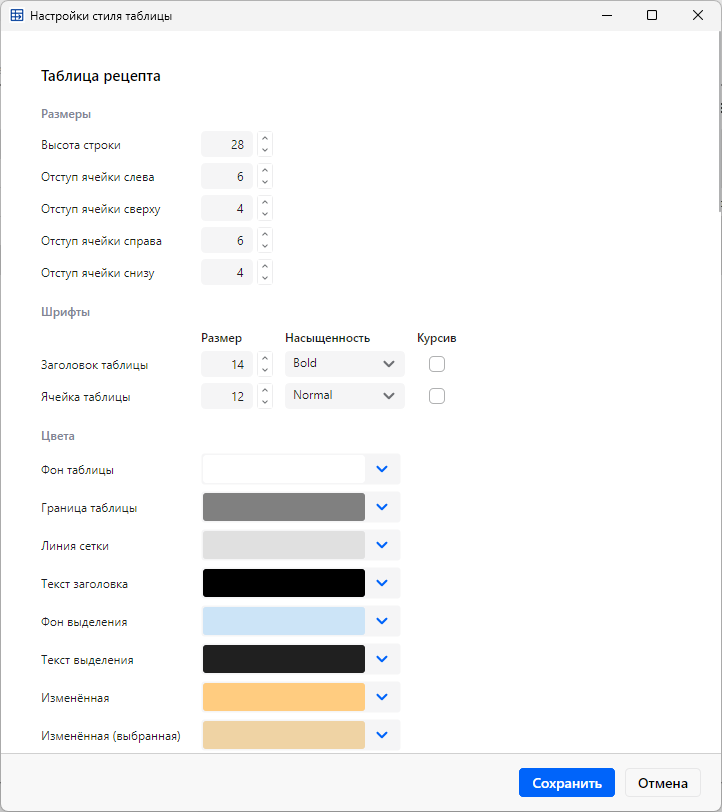

# Grid Style Configuration

## Overview

Every recipe-grid and app-chrome style flows from one YAML file per equipment config:
`{configDir}/ui/grid_style.yaml`. No style is hardcoded in the UI — fonts, paddings, row height,
cell/execution/selection palettes, status-bar and validation-panel chrome, the main-window
border/background/header colors, and the grid's default orientation all come from that file. An in-app editor edits the same file; the
operator does not hand-edit YAML. Changes apply on the next restart.

This file is the styling counterpart of `recipe-grid-column-sizing.md`: the sizing doc explains how a
column's width is computed; this one explains where the style values (including the font sizes that
feed that computation) come from and how they reach the screen.

## Visual theme vs config palette (the theming contract)

The app chrome (buttons, scrollbars, inputs, window surfaces) is themed by **Semi.Avalonia**, retinted
toward JetBrains/IntelliJ "New UI" tokens — **Light variant only**. The retint is applied by overriding
Semi's semantic-token keys (`SemiColorPrimary`, `SemiColorText0..3`, `SemiColorBackground0..3`,
`SemiColorBorder`, `SemiColorDisabledText`, the `*CornerRadius` keys → 4) plus the static tokens in
`Styles/ColorPalette.axaml`, all in `App.axaml`. The UI font is the native system Segoe UI (set via
`ChromeFontFamily` in `Styles/ColorPalette.axaml`); the grid uses that same Segoe family with OpenType
tabular figures (`+tnum`) so digit columns align without a monospaced font. There are no embedded fonts
(no `Assets/Fonts`).

The boundary between that fixed theme and per-equipment config is exact: **the brush keys the two
installers push from `grid_style.yaml`** (`CellPaletteInstaller`, `ExecutionPaletteInstaller`, listed in
"Resources projection" below) are the config-driven palette — cell states, selection, execution tints,
status bar, and app chrome. Everything else is the Semi-plus-overrides theme. Together those two — the
installer brush keys and the Semi semantic-token overrides in `App.axaml` — are the theming contract: a
config file restyles the grid/chrome palette through the installer keys without touching the base theme,
and the base theme governs every control the installers do not reach. Dark mode is deferred; styles
consume tokens via `DynamicResource` to stay dark-ready.

## YAML is the single source of truth

`grid_style.yaml` is the only style file. The other config sections (`actions/`, `columns/`,
`groups/`, `properties/`) are loaded by globbing `*.yaml` in their subfolder and merging. Grid styles
are the deliberate exception: `GridStyleLoader.LoadAsync` reads exactly one file —
`{configDir}/ui/grid_style.yaml` — never globbed, never merged. That keeps the editor's write target
unambiguous: one config-dir maps to one style file. If styles were ever split across `ui/*.yaml`,
write-back would have no single target, so single-file is intentional.

The file header documents the accepted hex formats (`#RRGGBB`, `#AARRGGBB`); the
writer preserves that header on save.

## The load pipeline

```
grid_style.yaml
  → GridStyleOptionsDto            (internal DTOs, snake_case [YamlMember], one per section)
  → GridStyleMapper.Map            (DTO → record, aggregated per-key validation, applies defaults)
  → GridStyleOptions               (immutable record, SemiStep.Core, Avalonia-free)
  → AppConfiguration.GridStyle     (bundled by ConfigFacade)
  → DI singleton                   (UiDi.AddUi: AppConfiguration.GridStyle registered as GridStyleOptions)
```

`ConfigFacade` loads the DTO, calls `GridStyleMapper.Map`, which validates and maps in one pass, and
bundles the resulting `GridStyleOptions` record into `AppConfiguration`. `UiDi.AddUi` registers
`AppConfiguration.GridStyle` as a `GridStyleOptions` singleton, so every consumer (the installers, the
column factories, `ColumnWidthCalculator`) injects the same typed record.

`GridStyleOptions` is an immutable record with a `Default` fallback used only by tests; the `#000000`
cell-palette placeholders in `Default` are never rendered in production.

Colors are the typed `StyleColor` value (channels `A`/`R`/`G`/`B`) end to end in the record; hex is a
string only at the two I/O edges. Validation lives inside the load mapper: `GridStyleMapper.Map` returns
a `Result<GridStyleOptions>` and accumulates every per-key error in one pass, so a single load reports
every missing or invalid key at once instead of failing on the first. There is no standalone color
validator — the parse and its format check sit at the one place the hex string enters the record.

## Record shape: nested per group

`GridStyleOptions` is a one-level nested root record. It composes ten per-group records (`Fonts`,
`Layout`, `Selection`, `ChangedCells`, `ReadOnlyCells`, `DisabledCells`, `Execution`, `StatusBar`,
`ValidationPanel`, `Chrome`) plus the root-level `Orientation`. `ReadOnlyCells` and `DisabledCells` share
one `DepthPalette` type. Consumers read short nested paths — `gridStyle.Fonts.CellFontSize`,
`gridStyle.ReadOnlyCells.Depth1`, `gridStyle.Chrome.GridLine`. Every group record is positional, so
construction is compile-checked: an omitted component is a CS7036 build error.

The nesting mirrors how the record is consumed — each reader takes one group (fonts, a palette, the
chrome block), never the whole record as a flat field list (see the resources projection and font-model
sections). The YAML file and the DTO layer keep their own nested snake_case shape with per-key error
reporting, and the load mapper owns the DTO-tree-to-group walk. `SaveThenLoad_DistinctFixture` proves the
nested record round-trips losslessly through the file format.

The error-path key `colors.grid_line` and the record path `Chrome.GridLine` deliberately diverge:
`grid_line` is a loose field in the `colors:` DTO section (beside `grid_border` / `grid_background`), but
the one-level record folds it into `Chrome` so the root carries no lone color field. The mapper-resident
validation emits the `colors.grid_line` key, not `chrome.grid_line`: the key names the YAML path the
operator edits, not the record path.

## Resources projection

The typed record is projected into `Application.Resources` at startup so XAML can bind styles via
`{DynamicResource}`:

- `CellPaletteInstaller.Install` pushes `SolidColorBrush` objects for the read-only / disabled / changed
  cell palettes, selection, grid line, status-bar and validation-panel colors, the app-wide
  `ErrorBrush` / `WarningBrush` (driven by the validation-panel severity colors), and all app-chrome
  brushes (`InfoBrush`, `ConnectedBrush`, `DisconnectedBrush`, `LocalModeBrush`, `ConnectingBrush`,
  `PanelBackgroundBrush`,
  `PanelHeaderBackgroundBrush`, `SubtleBorderBrush`, `SeparatorBrush`, `SecondaryForegroundBrush`,
  `GridBorderBrush`, `GridBackgroundBrush`, `HeaderForegroundBrush`).
- `ExecutionPaletteInstaller.Install` pushes the per-depth execution row brushes plus the
  current-step-marker brush.

The merged status-bar sync toggle draws its fill from four of those chrome brushes, one per sync
state: `LocalModeBrush` (grey `local_mode`, sync off / local mode), `ConnectingBrush`
(amber `connecting`, sync on and a PLC connect attempt in flight — the button shows "Connecting" with a
subtle three-dot animation), `DisconnectedBrush` (red `disconnected`, sync on and no link — settled),
and `ConnectedBrush` (green `connected`, sync on and link up). The connecting state distinguishes
"actively trying" from a settled "no link"; the four states are mutually exclusive. Like every other
chrome color, all four come from the `chrome:` section of `grid_style.yaml` under their snake_case
aliases (`connected`, `disconnected`, `local_mode`, `connecting`); `local_mode` defaults to `#6C707E`
and is installed as `LocalModeBrush`, `connecting` defaults to `#FFAF0F` (JetBrains warning amber) and
is installed as `ConnectingBrush`.

Alongside the brushes, the cell installer pushes a few **numeric / layout** resources that XAML
consumes directly: `StatusBarPadding` (a `Thickness`), `StatusBarItemSpacing` (a `double`), and
`ValidationPanelMaxHeight` (a `double`). These let the status bar and message panel read their layout
from config without a code-side calculation. The status-bar **font** resources are described in the
font-model section below.

## Grid orientation

A top-level key selects the recipe grid's startup orientation:

```yaml
orientation: rows_as_steps   # canonical (rows = steps); or columns_as_steps (transposed)
```

- **Values.** `rows_as_steps` (canonical) or `columns_as_steps` (transposed). An absent key
  defaults to `rows_as_steps`, so existing files load unchanged. The load mapper
  (`GridStyleMapper.Map`) rejects any other string with a config error naming both accepted values.
- **Typed model.** The record carries a Core enum, `GridStyleOptions.Orientation`
  (`GridOrientation.RowsAsSteps | ColumnsAsSteps`), not the raw string. Parsing and
  serialization go through `GridOrientationValues` (`Configuration/Dto/`); an absent DTO value
  parses to `RowsAsSteps`.
- **Consumer.** `ActiveRecipeGridSurface` reads the record value once at construction as the
  startup default (see `recipe-grid-surface.md`). The in-app toggle (View menu / `Ctrl+Shift+T`)
  is per-session; the config default applies again on the next launch — consistent with the
  restart-to-apply model of every other field in this file.
- **Writer round-trip.** `GridStyleDtoMapper` serializes from the enum, so it always emits a
  valid value: a style-editor save preserves the field, and a save over a file that never had
  it writes the explicit `orientation: rows_as_steps`. The editor does not surface orientation
  as a control; the editor's `BuildRecord` constructs the record positionally and carries the field
  straight from `_source.Orientation` (the seeded copy). The DTO property is declared last so
  serialized output keeps `fonts:` as the first key (pinned by test).
- **Shipped configs.** RIE ships `orientation: columns_as_steps` (transposed by default);
  MOCVD and MBE omit the key and start canonical.

## The font model

Fonts span every text role the palette drives. The model is one **global font family** plus
**per-role size, weight, and italic**. There are five roles:

| Role | Where it renders | Default size | Default weight | Default italic |
| --- | --- | --- | --- | --- |
| Grid header | column header text | 14 | 700 (Bold) | false |
| Grid cell | cell / numbering / combo text | 12 | 400 (Normal) | false |
| Status-bar text | all non-timer status text | 12 | 400 | false |
| Status-bar timer **label** | `Шаг:` / `Рецепт:` captions | 14 | 400 | false |
| Status-bar timer **value** | the two countdown readouts | 24 | 400 | false |

The earlier single `StatusBarTimerFontSize` (one size for both label and value) is **replaced** by the
two timer roles, so the caption and the countdown can carry independent fonts. With the shipped config
the label renders at 14 and the value at 24 — they no longer share one size.

- **Family** is a single `string` on the record (`GridStyleOptions.Fonts.FontFamily`). The default is `""`,
  meaning "grid default": consumers fall back to `GridFonts.DefaultFamily`
  (`"Segoe UI Variable Text, Segoe UI"`, the same proportional Segoe as the app chrome) and render with
  `GridFonts.TabularFigures` (the `tnum` feature) so digit columns stay aligned. A non-empty value sets
  the family for every role. The editor offers `FontManager.Current.SystemFonts`; an unknown saved
  family falls back to that Segoe default rather than failing.
- **Weight** is stored as an `int` (100–900) in the record and YAML — culture-free and easy to
  validate. Consumers cast it to Avalonia's `FontWeight` enum.
- **Italic** is a `bool`; consumers convert it to `FontStyle.Italic` / `FontStyle.Normal`.

### How each role reaches the screen

The status-bar roles use the **`DynamicResource` cascade**: `CellPaletteInstaller.Install` projects
the typed record into these resource keys, and `AppStatusBar.axaml` binds `TextElement.*` attached
properties to them (the global family + status-text role on the root `Border`; the timer label/value
roles set directly on the four timer `TextBlock`s):

| Resource key | Type | YAML source |
| --- | --- | --- |
| `AppFontFamily` | `FontFamily` | `fonts.family` |
| `StatusBarFontSize` | `double` | `status_bar.font_size` |
| `StatusBarFontWeight` | `FontWeight` | `status_bar.weight` |
| `StatusBarFontStyle` | `FontStyle` | `status_bar.italic` |
| `StatusBarTimerLabelFontSize` | `double` | `status_bar.timer_label_font_size` |
| `StatusBarTimerLabelFontWeight` | `FontWeight` | `status_bar.timer_label_weight` |
| `StatusBarTimerLabelFontStyle` | `FontStyle` | `status_bar.timer_label_italic` |
| `StatusBarTimerValueFontSize` | `double` | `status_bar.timer_value_font_size` |
| `StatusBarTimerValueFontWeight` | `FontWeight` | `status_bar.timer_value_weight` |
| `StatusBarTimerValueFontStyle` | `FontStyle` | `status_bar.timer_value_italic` |

The grid roles are **code-assigned**, not resources: `GridFontApplier` (used by `ColumnBuilder`,
`TextCellFactory`, and `ComboBoxCellFactory` in the canonical view, and by
`TransposedRecipeGridView` / `TransposedCellTemplateFactory` in the transposed view) sets `FontFamily` / `FontWeight` / `FontStyle` /
`FontSize` directly from the injected `GridStyleOptions` (the header's old hard-coded `FontWeight.Bold`
is now `HeaderFontWeight`) and also sets `TextElement.FontFeaturesProperty` to `GridFonts.TabularFigures`.
`ColumnBuilder` additionally sets that feature grid-wide so it reaches the `DataGridTextColumn`
numbering cells through inheritance. When the family is empty they fall back to `GridFonts.DefaultFamily`.
`ColumnWidthCalculator` builds its measuring `Typeface` from the same configured family/weight/italic and
calls `FormattedText.SetFontFeatures(GridFonts.TabularFigures)` so the measured width matches the
rendered cell (empty family → `GridFonts.DefaultFamily` for measurement). The grid font keys are read in
C# (see "Why the typed record cannot be replaced by raw resources"), so they have no resource projection.

### YAML keys

The font fields live in two DTO sections. All members are nullable; an omitted key falls back to the
default, so existing `grid_style.yaml` files load unchanged.

- `fonts:` — `family` (string), `header_size`, `header_weight`, `header_italic`,
  `cell_size`, `cell_weight`, `cell_italic`.
- `status_bar:` — `font_size`, `weight`, `italic`, `timer_label_font_size`, `timer_label_weight`,
  `timer_label_italic`, `timer_value_font_size`, `timer_value_weight`, `timer_value_italic`.

## Why the typed record cannot be replaced by raw resources

Colors and most layout values could live entirely as resources. `CellFontSize` cannot:
`ColumnWidthCalculator.MeasureText` needs it as a number in C# to measure text and size each column
(see `recipe-grid-column-sizing.md`). A `DynamicResource` brush is opaque to that code path. So the
typed `GridStyleOptions` record stays the canonical model, and resources are a projection of it — not
the other way around.

## Editor write-back

The in-app editor is the write path back to the same file:

```
GridStyleEditorWindow
  → GridStyleEditorViewModel    (per-group ReactiveObject drafts: Color per color, decimal? per size)
  → GridStyleEditorFacade       (the single public Core seam)
  → GridStyleWriter             (record → DTO, serialize, atomic write)
```

- **ViewModel.** A thin parent exposes each of the ten record groups as a per-group `ReactiveObject`
  draft (`Fonts`, `Layout`, `Selection`, …, `Chrome`), seeded from a mutable copy of the loaded record
  (a separate copy, never the DI singleton). A draft's property initializers are the seed — each leaf
  reads its same-named source component — and its `Build()` calls the group record's positional
  constructor, so a dropped field is a compile error (CS7036), not a silent revert. Colors are exposed
  as `Color` for the `ColorPicker`; sizes as `decimal?` for `NumericUpDown`. Channel↔`Color` conversion
  goes through `StyleColorConversions` (`ToMediaColor` / `ToStyleColor`, in `SemiStep.UI/Styles`), not
  `Color.ToString()`. The AXAML binds grouped `Group.Leaf` paths against the drafts, each resolved and
  compile-checked by the window-level `x:DataType` (a stale or mistyped path fails the build with
  AVLN2000). `CanSave` is gated by VM-side numeric range checks alone (font/padding/row-height/spacing/
  panel-height bounds); an invalid color is unrepresentable in the typed record, so there is nothing
  else to validate. The editor surfaces effectively the whole record: all ~54 colors, 13 numerics, plus
  the font controls — one global font-family `ComboBox`, and a per-role weight `ComboBox` (curated
  300–900 list) and italic `CheckBox`. The window groups these into two cards: **Fonts** (the family row
  plus a size / weight / italic row per role) and **Layout** (paddings, row height, status padding/
  spacing, panel height). The family/weight pickers always include the seeded value even when it is
  outside the offered list, so a hand-edited family or weight round-trips losslessly. `BuildRecord`
  constructs a new record positionally from the ten drafts' `Build()` calls, carrying the one unsurfaced
  field `Orientation` straight from the seeded source.



- **Facade.** `GridStyleEditorFacade` is the only public Core seam for the editor:
  `Load(configDir)` → `Task<Result<GridStyleOptions>>` and `Save(configDir, GridStyleOptions)` →
  `Task<Result>`. Both are async and run their file I/O off the UI thread; the editor's `SaveCommand`
  awaits `Save`. The seam carries no validate step: color validation lives in the load mapper and
  numeric ranges are checked VM-side, so there is nothing left for the editor to ask Core to validate
  before a save. The loader, writer, and the ~12 DTOs stay
  `internal`. The UI never touches Core internals directly.
  (Layering: the config stays in `SemiStep.Core`, settled by review; the editor reaches it only through
  this facade.)
- **Writer.** `GridStyleWriter` maps the record back to the DTO (`GridStyleDtoMapper`), serializes with
  the underscored naming convention, re-prepends the file's leading comment block (the header), then
  normalizes to LF and writes UTF-8 no-BOM via a temp-then-move atomic replace in the same `ui/` dir.
  The temp write and the header read are async (`WriteAllTextAsync` / `ReadAllLinesAsync`); the final
  `File.Move` stays synchronous — there is no async move, and it is a fast metadata rename inside the
  same try/catch. Every color DTO property carries `[YamlMember(ScalarStyle = ScalarStyle.DoubleQuoted)]`
  so hex values emit quoted and quoting stays uniform.

The editor edits the **merged** record (defaults already applied), so `Save` writes a
fully-populated file — every key is emitted, no omitted-key preservation. That is acceptable for a
one-file settings editor and removes any in-place DTO-patching.

## Restart to apply

v1 applies changes on restart: the loader re-runs the normal pipeline on the next launch and the new
values flow through. There is no live preview. Live color preview is deferred (Task 8): it would
require the installers to re-push brushes through a provider on change. Font and size changes always
need a layout rebuild regardless (they feed `ColumnWidthCalculator` and the column build), so a full
restart is the simplest correct behavior for v1.

## What is intentionally not wired

- **Execution depth-0.** `ExecutionDepth0Color` / `ExecRowDepth0Brush` stay installed for palette
  symmetry but have no `for-depth-0` selector. `RecipeRowExecutionClassBinder` binds only
  `current-step` / `past-step` / `for-depth-1..3`, and depth-0 already renders default white
  (`#FFFFFF`), so a selector would be a no-op. The brush is installed; no selector is added.
- **Removed fields.** Grid-line thickness, alternating-row background, and normal-row background were
  dropped from the model, DTOs, mapper, and shipped configs. Semi's `DataGrid` exposes no
  inner-gridline-thickness or alternating-row-background property, so they had no wire target.
