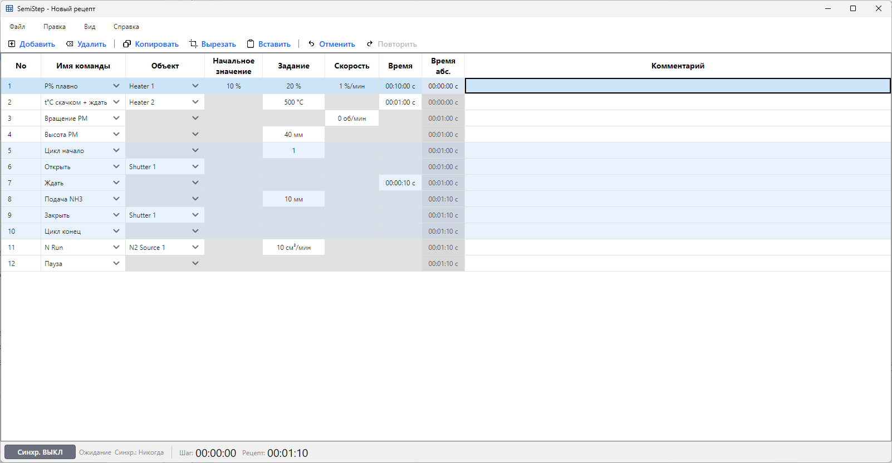
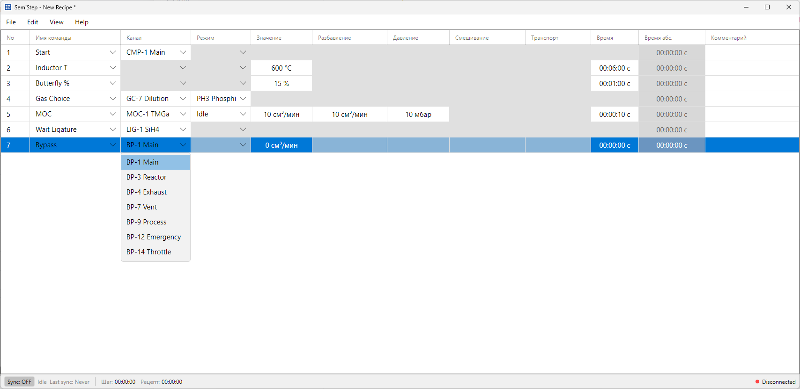
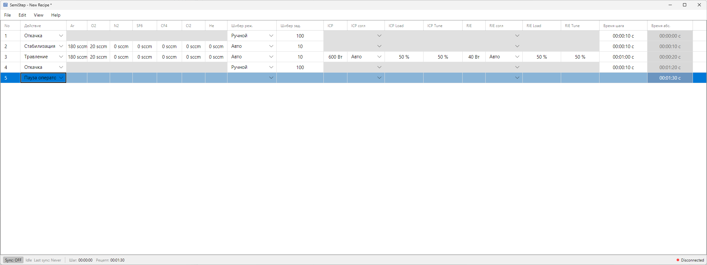

# Руководство пользователя

Приложение для редактирования и исполнения технологических рецептов ПЛК.

---

## Содержание

**Часть I. Руководство пользователя**

- [1. Общие сведения](#1-общие-сведения)
    - [1.1. Назначение системы](#11-назначение-системы)
    - [1.2. Платформа](#12-платформа)
- [2. Пользовательский интерфейс](#2-пользовательский-интерфейс)
    - [2.1. Оконная модель](#21-оконная-модель)
    - [2.2. Общий вид окон](#22-общий-вид-окон)
    - [2.3. Табличное представление рецепта](#23-табличное-представление-рецепта)
    - [2.4. Редактирование и навигация](#24-редактирование-и-навигация)
    - [2.5. Блокировка редактирования](#25-блокировка-редактирования)
    - [2.6. Отображение исполнения](#26-отображение-исполнения)
- [3. Модель данных рецепта](#3-модель-данных-рецепта)
    - [3.1. Структура рецепта](#31-структура-рецепта)
    - [3.2. Служебные (базовые) действия](#32-служебные-базовые-действия)
    - [3.3. Циклы (For)](#33-циклы-for)
    - [3.4. Ограничения](#34-ограничения)
    - [3.5. Валидация данных](#35-валидация-данных)
    - [3.6. Импорт CSV](#36-импорт-csv)
- [4. Работа с ПЛК](#4-работа-с-плк)
    - [4.1. Подключение и синхронизация](#41-подключение-и-синхронизация)
    - [4.2. Согласование и разрешение конфликтов](#42-согласование-и-разрешение-конфликтов)
    - [4.3. Мониторинг исполнения](#43-мониторинг-исполнения)
    - [4.4. Состояния синхронизации](#44-состояния-синхронизации)
    - [4.5. Обработка ошибок связи](#45-обработка-ошибок-связи)
- [5. Логирование](#5-логирование)

**Часть II. Настройка и техническая спецификация**

- [6. Конфигурация приложения](#6-конфигурация-приложения)
    - [6.1. Расположение конфигурации](#61-расположение-конфигурации)
    - [6.2. Состав конфигурации](#62-состав-конфигурации)
    - [6.3. connection.yaml](#63-connectionyaml)
    - [6.4. properties.yaml](#64-propertiesyaml)
    - [6.5. columns.yaml](#65-columnsyaml)
    - [6.6. groups](#66-groups)
    - [6.7. actions](#67-actions)
    - [6.8. grid_style.yaml](#68-grid_styleyaml)
- [7. Протокол S7 — техническая спецификация](#7-протокол-s7--техническая-спецификация)
    - [7.1. Определения](#71-определения)
    - [7.2. Транспорт и типы данных](#72-транспорт-и-типы-данных)
    - [7.3. Управляющая область](#73-управляющая-область)
    - [7.4. Датаблоки данных](#74-датаблоки-данных)
    - [7.5. Область исполнения](#75-область-исполнения)
    - [7.6. Сценарии обмена](#76-сценарии-обмена)
- [8. Настройка ПЛК (TIA Portal)](#8-настройка-плк-tia-portal)

---

**Часть I. Руководство пользователя**

---

## 1. Общие сведения

### 1.1. Назначение системы

Приложение предназначено для:

- создания, редактирования и проверки технологических рецептов (последовательностей шагов);
- передачи рецептов в ПЛК и обратного чтения;
- контроля состояния исполнения рецепта в режиме онлайн;
- сохранения рецепта в файл и загрузки из файла.

**Цель** — предоставить удобный инструмент работы с рецептами, независимый от конкретной SCADA-системы.

---

### 1.2. Платформа

| Компонент    | Значение                                      |
| ------------ | --------------------------------------------- |
| ОС           | Windows 10 / Windows 11 (64-bit)              |
| Среда        | .NET 10                                       |
| Протокол ПЛК | S7 TCP/IP (Siemens S7-1200 / S7-1500)         |
| Конфигурация | YAML-файлы, загружаемые при старте приложения |

Применяется на ПК под Windows, подключённом к Siemens ПЛК по S7 TCP/IP с известным IP-адресом.

[↑ К содержанию](#содержание)

---

## 2. Пользовательский интерфейс

### 2.1. Оконная модель


_Окна разных установок (MBE, MOCVD, RIE) используют единую модель — различается только конфигурация._

Все окна приложения однотипны. Поддерживается любое доступное количество одновременно открытых экземпляров.

Каждое окно имеет **возможность** подключения к ПЛК кнопкой **Connect**:

- **Connect активен** — окно подключено к ПЛК: отображается состояние рецепта в контроллере, доступны операции синхронизации (загрузка в ПЛК, чтение из ПЛК, мониторинг исполнения).
- **Connect неактивен** — окно работает в автономном режиме: доступно редактирование файлов рецепта на диске (открытие, сохранение, редактирование, копирование).

---

### 2.2. Общий вид окон


_Окно установки MOCVD._

В каждом окне:

- основная область с табличным представлением рецепта;
- панель инструментов с основными командами для данного типа окна;
- статус-бар с индикацией подключения к ПЛК и состояния синхронизации;
- панель сообщений/логов.

---

### 2.3. Табличное представление рецепта


_Окно установки RIE._

- Строки соответствуют шагам рецепта (1..N).
- Столбцы соответствуют параметрам и служебным полям шага.
- Заголовок столбцов отображает названия параметров.

---

### 2.4. Редактирование и навигация

Редактирование ячеек по аналогии с табличными редакторами.

#### 2.4.1. Базовый набор горячих клавиш

| Комбинация     | Действие        |
| -------------- | --------------- |
| `Ctrl+C`       | Копирование     |
| `Ctrl+V`       | Вставка         |
| `Ctrl+X`       | Вырезание       |
| `Ctrl+N`       | Добавление шага |
| `Del`          | Удаление шага   |
| `Ctrl+Z`       | Отмена (Undo)   |
| `Shift+Ctrl+Z` | Повтор (Redo)   |

#### 2.4.2. Визуальная индикация

- выделение активной строки/ячейки;
- подсветка текущего шага исполнения (если есть данные от ПЛК).

---

### 2.5. Блокировка редактирования

При активном исполнении рецепта (по данным от ПЛК) редактирование блокируется, становятся недоступными операции, которые могут привести к неконсистентности исполняемого рецепта, такие как удаление/добавление шагов.

---

### 2.6. Отображение исполнения

#### 2.6.1. Окраска строк по глубине вложенности циклов

Строки таблицы тонируются по глубине вложенности блока `For` — повторяемой группы шагов, ограниченной парой служебных шагов «Цикл начало»/«Цикл конец» (подробно — раздел 3.3). Палитра задаётся в `ui/grid_style.yaml` в секции `colors.cells.execution` и включает четыре уровня глубины (0..3) × два состояния (не пройдена / пройдена), что даёт восемь цветов фона.

Правила тонировки:

- Шаги, лежащие вне любого `For`-блока, отображаются базовым цветом строки.
- Шаги внутри `For`-блока получают цвет, соответствующий глубине вложенности блока.
- Строки «Цикл начало» (`For`) и «Цикл конец» (`End_For`) тонируются наравне с шагами внутри блока — они получают цвет того блока, который ограничивают.
- Глубина ограничивается значением 3: при большей фактической вложенности применяется цвет `depth_3`.

#### 2.6.2. Маркер текущего шага в колонке номера

В колонке `№` текущий исполняемый шаг подсвечивается отдельным цветом, который задаётся ключом `current_step_marker` в секции `colors.cells.execution` файла `ui/grid_style.yaml`. Маркер заливает фон ячейки номера и не зависит от выделения строки пользователем: при перемещении курсора подсветка остаётся на исполняемом шаге.

#### 2.6.3. Статус-бар: оставшееся время

В статус-баре окна отображаются:

- **Время до конца текущего шага** — длительность шага минус прошедшее с его начала время (по данным ПЛК). Шаги без собственной длительности — мгновенные служебные действия `For`/`End_For` и «Пауза» (раздел 3.2) — в расчёт не входят.
- **Время до конца рецепта** — оставшееся время текущего шага плюс сумма длительностей последующих шагов. Те же шаги без длительности игнорируются. Развёртка `For`-блоков выполняется с учётом текущего значения счётчика итераций (отдаётся ПЛК).

Состояния отображения:

- Рецепт не загружен либо снапшот рецепта недоступен — отображается прочерк (`—`) для обоих значений.
- Рецепт загружен, но не исполняется (включая отсутствие связи с ПЛК) — отображается `(00:00:00, полная длительность рецепта)`: оператор видит полную длительность рецепта до нажатия `Start`.
- Рецепт исполняется — отображаются вычисленные значения по алгоритму выше.

Формат вывода:

- `чч:мм:сс` при длительности менее 24 часов;
- `d.чч:мм:сс` при длительности 24 часа и более (переключение автоматическое, по значению).

#### 2.6.4. Выход из подрежима исполнения

После прекращения исполнения (ПЛК сбрасывает бит «рецепт исполняется» или окно переключается в автономный режим / теряет связь) времена в статус-баре переключаются на idle-отображение `(00:00:00, полная длительность рецепта)`.

#### 2.6.5. Палитры read-only и disabled ячеек

В таблице рецепта существуют два независимых визуальных состояния ячейки:

- **Read-only** — структурная неизменяемость на уровне столбца: применяется ко всему столбцу одинаково, независимо от строки (пример: столбец номера шага `№`).
- **Disabled (inapplicable)** — неприменимость свойства к типу действия в данной строке: для одного и того же столбца ячейка может быть disabled в одной строке и редактируемой в другой.

Состояния взаимоисключающие: если столбец доступен только для чтения, к его ячейкам всегда применяется палитра `readonly` (палитра `disabled` к ним не применяется). Цвета палитр задаются в `ui/grid_style.yaml` — формат и полный перечень ключей в разделе 6.8.

[↑ К содержанию](#содержание)

---

## 3. Модель данных рецепта

### 3.1. Структура рецепта

- **Рецепт** — упорядоченный список шагов.
- **Шаг** определяется парой «тип действия + параметры» и содержит:
    - тип действия;
    - набор параметров (значения по параметрам, определённым конфигурацией);
    - комментарий и служебные поля (при необходимости).

Состав действий, параметров и столбцов задаётся YAML-конфигурацией установки (см. раздел 6).

---

### 3.2. Служебные (базовые) действия

Помимо технологических действий, настраиваемых под установку, рецепт использует четыре **служебных действия** с фиксированной семантикой исполнения. Они доступны в списке типов действий наравне с остальными, но их поведение предопределено и одинаково во всех установках: на них опираются окраска циклов, счётчики итераций и расчёт оставшегося времени.

| Действие        | Длительность | Поведение при исполнении                                                                                                                            |
| --------------- | ------------ | --------------------------------------------------------------------------------------------------------------------------------------------------- |
| **Ждать**       | длительное   | Выдержка заданного времени; следующий шаг начинается по его истечении. Единственное служебное действие с собственной длительностью.                 |
| **Цикл начало** | мгновенное   | Открывает блок повторения (`For`). Может задавать число итераций блока, если это предусмотрено конфигурацией; иначе число итераций приходит от ПЛК. |
| **Цикл конец**  | мгновенное   | Закрывает ближайший открытый блок `For` (`End_For`); возвращает исполнение к началу блока, пока не исчерпаны итерации.                              |
| **Пауза**       | мгновенное   | Останавливает исполнение и ждёт подтверждения оператора, затем продолжает со следующего шага.                                                       |

Конфигурационная сторона (зарезервированные идентификаторы и обязательные столбцы) — в разделе 6.7.

---

### 3.3. Циклы (`For`)

Пара шагов «Цикл начало» … «Цикл конец» образует **блок `For`** — последовательность шагов, повторяемую заданное число раз:

- Каждому шагу «Цикл начало» соответствует один закрывающий «Цикл конец»; они ограничивают тело блока.
- Блоки допускают вложенность (блок внутри блока), до **трёх уровней**.
- Открывающий и закрывающий шаги — полноправные шаги рецепта: занимают строки таблицы, тонируются цветом своего блока (раздел 2.6.1) и подсвечиваются как текущий шаг.

Если конфигурация установки задаёт у действия «Цикл начало» параметр числа итераций (столбец с ключом `task`), приложение использует его для оценки оставшегося времени. Если такой параметр не задан, число итераций определяется только ПЛК во время исполнения, а при оценке длительности блок считается за одну итерацию. Текущий номер итерации каждого уровня вложенности приложение получает от ПЛК.

---

### 3.4. Ограничения

Ориентировачное количество шагов/параметров, поддерживаемое на стандартной машине, без серьезной деградации по производительности:

| Параметр            | Значение |
| ------------------- | -------- |
| Максимум шагов      | ~1000    |
| Максимум параметров | ~30      |

Конкретный набор параметров и их типы задаются конфигурацией установки.

---

### 3.5. Валидация данных

На основе типов параметров и их ограничений:

- диапазоны значений;
- формат данных;
- обязательность заполнения.

**При вводе недопустимых значений:**

- отображается понятное сообщение;
- запрещается сохранение/отправка рецепта в ПЛК до исправления ошибок.

---

### 3.6. Импорт CSV

Импорт рецепта из CSV выполняется **дословно**: значения ячеек загружаются как есть, **inline-формулы при импорте не вычисляются** (см. раздел 6.7.1) и не используются для проверки внутренней согласованности файла. Редактирование файла рецепта сторонними средствами происходит под ответственность пользователя.

[↑ К содержанию](#содержание)

---

## 4. Работа с ПЛК

Этот раздел описывает поведение приложения при работе с ПЛК. Байтовая раскладка датаблоков и протокол обмена — в разделе 7.

### 4.1. Подключение и синхронизация

Синхронизация с ПЛК **опциональна** и управляется пользователем кнопкой **Connect**.

При включении синхронизации:

1. Устанавливается S7-соединение с ПЛК.
2. Выполняется согласование версии протокола и состояния рецепта (см. разделы 4.2 и 7.3).
3. При каждом успешном изменении рецепта запускается отложенная (≈1 с) запись в ПЛК.

При отключении синхронизации соединение разрывается, мониторинг исполнения останавливается.

> **ПК — источник истины.** Рецепт всегда хранится в файле на ПК. При любом сбое связи рецепт перезаписывается в ПЛК полностью; частичное восстановление не выполняется.

---

### 4.2. Согласование и разрешение конфликтов

При включении синхронизации приложение читает управляющую область ПЛК и согласует состояние. Рецепты ПЛК и ПК считаются совпавшими, когда совпадают тип действия и значения всех параметров в каждом шаге:

| Состояние ПЛК                        | Состояние ПК | Действие                                                   |
| ------------------------------------ | ------------ | ---------------------------------------------------------- |
| рецепт не зафиксирован               | любое        | Немедленно перезаписать рецепт из ПК в ПЛК (без запроса)   |
| зафиксирован, ПЛК = ПК               | совпадают    | Нет действий                                               |
| зафиксирован, ПЛК ≠ ПК, ПК пустой    | ПЛК непустой | Загрузить рецепт из ПЛК в ПК автоматически                 |
| зафиксирован, ПЛК ≠ ПК, оба непустые | оба непустые | Показать диалог конфликта — пользователь выбирает источник |

> **Диалог конфликта** предлагает сохранить локальную версию или загрузить версию из ПЛК.

При несовпадении версии протокола синхронизация не выполняется (см. раздел 7.3).

---

### 4.3. Мониторинг исполнения

При активной синхронизации приложение периодически читает область исполнения ПЛК и отражает прогресс:

- **режим UI**: при активном исполнении (`recipe_active = true`) редактирование и запись в ПЛК заблокированы (режим мониторинга); при `recipe_active = false` доступно редактирование;
- **подсветка** текущего и пройденных шагов по номеру исполняемой строки;
- **оставшееся время** шага и рецепта (см. раздел 2.6.3);
- **итерации циклов `For`** по счётчикам ПЛК (см. раздел 3.3).

Состав полей области исполнения — в разделе 7.5.

---

### 4.4. Состояния синхронизации

В статус-баре отображается текущее состояние:

| Состояние    | Описание                                             |
| ------------ | ---------------------------------------------------- |
| Idle         | Синхронизация включена, ожидание изменений           |
| Syncing      | Запись рецепта в ПЛК выполняется                     |
| Synced       | Рецепт успешно записан; показано время синхронизации |
| Failed       | Ошибка при записи; текст ошибки отображается красным |

Наличие связи с ПЛК кодируется цветом заливки объединённой кнопки синхронизации в статус-баре: серый — синхронизация выключена (локальный режим), янтарный — синхронизация включена и идёт установление связи с ПЛК (кнопка показывает «Connecting» с мягкой анимацией из трёх точек), красный — синхронизация включена, но связи нет, зелёный — синхронизация включена и связь есть. Янтарное состояние показывается на время попытки подключения и отличает «идёт подключение» от установившегося «связи нет». Отдельной метки подключения в статус-баре больше нет. Если связь теряется при включённой синхронизации, это сообщается как ошибка с текстом «PLC connection lost». Состояние `Out of sync` (рецепт невалиден и не будет записан) остаётся в модели, но собственного текста в статус-баре больше не выводит.

После каждой записи в ПЛК приложение считывает данные обратно и сверяет с отправленными; при несоответствии запись повторяется (число попыток настраивается, см. раздел 6.3). При исчерпании попыток состояние — `Failed`.

---

### 4.5. Обработка ошибок связи

При ошибках подключения/обмена приложение:

- отображает пользователю ясные сообщения о сбоях;
- не переходит в неконсистентное состояние;
- позволяет повторить операцию без перезапуска.

| Ситуация                       | Поведение                                                                   |
| ------------------------------ | --------------------------------------------------------------------------- |
| Ошибка записи                  | Прервать; при восстановлении связи рецепт перезаписывается целиком          |
| Обрыв связи на середине записи | Рецепт в ПЛК остаётся незафиксированным; при реконнекте — полная перезапись |
| Таймаут подключения            | Сообщение пользователю, повтор подключения                                  |

[↑ К содержанию](#содержание)

---

## 5. Логирование

- Путь к файлу: `C:\DISTR\Logs\Semistep\semistep.log` (переопределяется ключом запуска `--log-file`).
- Ротация по размеру: 5 МБ на файл, хранится до 5 файлов.
- Формат записи: метка времени, уровень, источник, сообщение, исключение.
- Уровень детализации задаётся ключом запуска `--logging-level`.

Логируются: операции с ПЛК (подключение, чтение, запись), чтение/запись рецептов, ошибки валидации конфигурации, исключения.

[↑ К содержанию](#содержание)

---

**Часть II. Настройка и техническая спецификация**

> Часть для инженеров пусконаладки. Описывает конфигурационные файлы, протокол обмена и настройку ПЛК.

---

## 6. Конфигурация приложения

### 6.1. Расположение конфигурации

Каталог конфигурации задаётся при установке (поставляется инсталлятором) и может быть переопределён для каждого окна/запуска ключом командной строки `--config-dir <путь>`. Прочие ключи запуска — в разделе 5.

Конфигурация и раскладка датаблоков проверяются при старте. При обнаружении ошибок (отсутствует обязательный каталог/файл, недопустимое значение, перекрытие полей или нехватка `managing_db_total_size` / `execution_db_total_size`) приложение **не запускается**: вместо главного окна показывается окно ошибки со списком всех нарушений; полный текст дублируется в журнал (раздел 5).

> Часть ограничений проверяется только в рантайме (см. примечания в §6.4, §6.5, §6.7 и §7.4): неверный размер массивов данных, повтор номеров DB, опечатки в `column_type`/`format_kind` не блокируют старт.

### 6.2. Состав конфигурации

Каталог конфигурации содержит шесть обязательных подкаталогов. Отсутствие любого из них прерывает запуск.

| Каталог       | Назначение                                            | Раздел |
| ------------- | ----------------------------------------------------- | ------ |
| `connection/` | Подключение к ПЛК и раскладка датаблоков              | 6.3    |
| `properties/` | Типы параметров (единицы, диапазоны, формат)          | 6.4    |
| `columns/`    | Столбцы таблицы рецепта                               | 6.5    |
| `groups/`     | Списки значений для выпадающих списков (объекты/цели) | 6.6    |
| `actions/`    | Типы действий (шагов) рецепта                         | 6.7    |
| `ui/`         | Оформление таблицы (`grid_style.yaml`)                | 6.8    |

Поставляемые образцы (`MBE`, `MOCVD`, `RIE`) можно использовать как шаблоны.

---

### 6.3. `connection.yaml`

Подключение к ПЛК и адреса/смещения всех датаблоков. Значения должны соответствовать проекту в TIA Portal (см. раздел 8).

**Подключение:**

| Ключ                      | Назначение                          | Пример              |
| ------------------------- | ----------------------------------- | ------------------- |
| `connection_file_version` | Версия формата файла (фиксирована)  | `"1.0"`             |
| `connection_protocol`     | Версия протокола (фиксирована)      | `"1.0"`             |
| `ip`                      | Адрес ПЛК `host:port` (порт S7 102) | `"192.168.0.1:102"` |
| `plc_rack`, `plc_slot`    | Стойка и слот CPU                   | `0`, `1`            |

**Настройки протокола:**

| Ключ                     | Назначение                                     | Пример |
| ------------------------ | ---------------------------------------------- | ------ |
| `max_retries_attempts`   | Число повторов записи при расхождении проверки | `3`    |
| `polling_interval_ms`    | Период опроса области исполнения, мс           | `100`  |
| `writing_timeout_ms`     | Таймаут записи, мс                             | `5000` |
| `commit_timeout_ms`      | Таймаут фиксации, мс                           | `5000` |
| `keep_alive_interval_ms` | Период keep-alive, мс                          | `5000` |

**Раскладка датаблоков:**

| Ключ                      | Назначение                                       |
| ------------------------- | ------------------------------------------------ |
| `*_db_number`             | Номера DB (managing/int/float/string/execution)  |
| `*_offset`                | Смещения полей внутри датаблоков (байты)         |
| `managing_db_total_size`  | Размер управляющей области, байт (например `10`) |
| `execution_db_total_size` | Размер области исполнения, байт (например `22`)  |

> Пять номеров DB (`*_db_number`) должны быть **взаимно различны** и не пересекаться с другими DB программы ПЛК. Приложение это **не проверяет** — повтор номера приводит к порче данных в рантайме. В примере ниже использованы условные `1`–`5`; в поставляемых образцах — `995`–`999`.

```yaml
connection_file_version: "1.0"

# Подключение
ip: "192.168.0.1:102"
connection_protocol: "1.0"
plc_rack: 0
plc_slot: 1

# Настройки протокола
max_retries_attempts: 3
polling_interval_ms: 100
writing_timeout_ms: 5000
commit_timeout_ms: 5000
keep_alive_interval_ms: 5000

# Управляющая область
managing_db_number: 1
version_offset: 0
committed_offset: 4
recipe_lines_offset: 6
managing_db_total_size: 10

# Данные: int / float / string
int_db_number: 3
int_db_total_capacity_offset: 0
int_db_current_size_offset: 4
int_db_data_offset: 8
# (float_db_* и string_db_* — аналогично, со своими номерами DB)

# Область исполнения
execution_db_number: 2
recipe_active_offset: 0
actual_line_offset: 2
step_current_time_offset: 6
for_loop_count1_offset: 10
for_loop_count2_offset: 14
for_loop_count3_offset: 18
execution_db_total_size: 22
```

Раскладка полей по смещениям описана в разделах 7.3–7.5.

---

### 6.4. `properties.yaml`

Определяет **типы параметров**: единицы, диапазоны и формат отображения. Каждый верхнеуровневый ключ — идентификатор типа параметра, на который ссылаются столбцы (6.5) и действия (6.7).

| Ключ          | Обяз.  | Значение                                             |
| ------------- | ------ | ---------------------------------------------------- |
| `system_type` | да     | `int` \| `float` \| `string`                         |
| `format_kind` | да     | Распознаются `numeric` и `time_hms` (см. примечание) |
| `units`       | нет    | Единицы измерения (отображаются в UI)                |
| `min`, `max`  | нет    | Допустимый диапазон значения                         |
| `max_length`  | строк. | Максимум символов (только для `system_type: string`) |

Правила:

- Должно быть объявлено **хотя бы одно** свойство `system_type: string`.
- **Все** строковые свойства обязаны иметь **одинаковый положительный** `max_length` — это значение определяет размер строкового элемента в ПЛК (см. раздел 8). Нарушение прерывает запуск.
- `format_kind` обязателен, но его **значение не проверяется**: распознаются `numeric` и `time_hms`, любое иное значение трактуется как `numeric` и не вызывает ошибки при загрузке.

> **`enum`** — зарезервированный `property_type_id` для столбцов-выпадающих списков. Свойство с идентификатором `enum` (`system_type: int`) должно быть объявлено в `properties.yaml`, а каждый столбец с `property_type_id: enum` обязан задавать `group_name` (раздел 6.6).

```yaml
temp:
    system_type: float
    format_kind: numeric
    units: "°C"
    min: 0
    max: 2000

time:
    system_type: float
    format_kind: time_hms
    units: "с"
    min: 0
    max: 86400

string:
    system_type: string
    format_kind: numeric
    units: ""
    max_length: 64

enum:
    system_type: int
    format_kind: numeric
    units: ""
```

---

### 6.5. `columns.yaml`

Определяет **столбцы** таблицы рецепта. Каждый верхнеуровневый ключ — идентификатор столбца, на который ссылаются действия (6.7).

| Ключ                              | Обяз. | Значение                                          |
| --------------------------------- | ----- | ------------------------------------------------- |
| `column_type`                     | да    | Тип столбца (см. ниже)                            |
| `ui.ui_name`                      | да    | Заголовок столбца в таблице                       |
| `business_logic.property_type_id` | да    | Идентификатор типа параметра из `properties.yaml` |
| `business_logic.read_only`        | нет   | Только для чтения (по умолчанию `false`)          |
| `business_logic.save_to_csv`      | нет   | Сохранять в CSV (по умолчанию `false`)            |

Допустимые `column_type`:

| Значение                  | Назначение                                    |
| ------------------------- | --------------------------------------------- |
| `action_combo_box`        | Выбор типа действия шага                      |
| `action_target_combo_box` | Выбор объекта/цели действия (из группы)       |
| `property_field`          | Редактируемое значение параметра              |
| `step_start_time_field`   | Вычисляемое время начала шага (только чтение) |
| `text_field`              | Текстовое поле (например, комментарий)        |

> `column_type` **не проверяется** при загрузке: опечатка не вызывает ошибку, но столбец не отрисуется корректно. Требуется точное совпадение с одним из значений выше.

```yaml
task:
    column_type: property_field
    ui:
        ui_name: "Задание"
    business_logic:
        property_type_id: float
        read_only: false
        save_to_csv: true

comment:
    column_type: text_field
    ui:
        ui_name: "Комментарий"
    business_logic:
        property_type_id: string
        save_to_csv: true
        read_only: false
```

---

### 6.6. `groups`

Списки значений для столбцов-выпадающих списков (объекты/цели). Каждый верхнеуровневый ключ — `group_id`, на который ссылаются действия через `group_name`; значение — отображение «целочисленный ключ → подпись».

`group_id` уникальны по всем файлам каталога; любой `group_name`, на который ссылается действие, должен существовать.

```yaml
heater:
    1: "Heater 1"
    2: "Heater 2"
    3: "Heater 3"
```

---

### 6.7. `actions`

Определяет **типы действий** (шагов). Это основной объём настройки установки. Верхнеуровневый ключ — числовой `Id` действия (положительный, **уникальный по всем файлам** каталога).

| Ключ                         | Обяз. | Значение                                                            |
| ---------------------------- | ----- | ------------------------------------------------------------------- |
| `ui_name`                    | да    | Название действия в выпадающем списке                               |
| `deploy_duration`            | да    | `immediate` (мгновенное) \| `longlasting` (длительное, имеет время) |
| `columns`                    | да    | Список столбцов действия                                            |
| `columns[].key`              | да    | Идентификатор столбца из `columns.yaml`                             |
| `columns[].property_type_id` | да    | Тип параметра из `properties.yaml`                                  |
| `columns[].group_name`       | усл.  | Имя группы (6.6) — **обязательно** для столбцов с типом `enum`      |
| `columns[].default_value`    | нет   | Значение по умолчанию (должно проходить валидацию типа/диапазона)   |
| `formula`                    | нет   | Связь параметров (см. 6.7.1): `recalc_order` + `expressions`        |

**Зарезервированные `Id`** — `10` (Ждать), `20` (Цикл начало), `30` (Цикл конец), `40` (Пауза) — закреплены за служебными действиями с фиксированной семантикой (раздел 3.2) и не должны переиспользоваться обычными действиями. Действия опознаются только по числовому `Id`; приложение не требует их наличия и не проверяет состав их столбцов — корректность на стороне инженера.

> **Обязательные ключи столбцов с фиксированным смыслом:**
>
> - Действие с `deploy_duration: longlasting` (в т.ч. `Id 10` «Ждать») должно содержать столбец с ключом ровно `step_duration` (тип `time`). Без него длительность шага молча считается нулевой — расчёт оставшегося времени будет неверным.
> - Действие `Id 20` «Цикл начало» должно содержать столбец с ключом ровно `task` (целое числовое значение) для числа итераций. Без него число итераций по умолчанию = 1 (как в образцах RIE/MOCVD).

```yaml
# Температура, плавно (с inline-формулой)
110:
    ui_name: "t°C плавно"
    deploy_duration: immediate
    columns:
        - key: target
          group_name: heater
          property_type_id: enum
        - key: initial_value
          property_type_id: temp
          default_value: "500"
        - key: task
          property_type_id: temp
          default_value: "600"
        - key: speed
          property_type_id: temp_speed
          default_value: "10"
        - key: step_duration
          property_type_id: time
          default_value: "600"
        - key: comment
          property_type_id: string
    formula:
        recalc_order: [step_duration, speed, task, initial_value]
        expressions:
            step_duration: "(task - initial_value) / speed * 60"
            speed: "(task - initial_value) / step_duration * 60"
            task: "initial_value + speed * step_duration / 60"
            initial_value: "task - speed * step_duration / 60"
```

#### 6.7.1. Связанные параметры (inline-формулы)

Действие может объявлять алгебраическую связь между несколькими своими параметрами (блок `formula`: `recalc_order` + `expressions`). Пример выше для «t°C плавно» задаёт соотношение `(task − initial_value) / speed · 60 = step_duration`.

**Поведение при редактировании:**

- При изменении одного из связанных параметров приложение автоматически пересчитывает один другой параметр той же строки так, чтобы соотношение оставалось выполненным. Все связанные ячейки остаются редактируемыми — цель пересчёта определяется порядком `recalc_order`.
- Исходная правка и пересчитанное значение образуют **одну запись истории** — `Ctrl+Z` отменяет обе одновременно.
- Если пересчёт невозможен (деление на ноль, результат вне допустимого диапазона параметра) — правка **отклоняется целиком**: рецепт остаётся неизменным, причина отказа отображается в панели сообщений.

**Ограничения (проверяются при загрузке; нарушение блокирует запуск):**

- `recalc_order` содержит не менее двух параметров;
- все параметры `recalc_order` — числовые (`int`/`float`);
- множество переменных в `expressions` совпадает с `recalc_order`;
- имена в выражениях совпадают с именами параметров с учётом регистра.

---

### 6.8. `grid_style.yaml`

Оформление таблицы. Цвета задаются hex-строкой формата **`#RRGGBB`** или **`#AARRGGBB`** (6 или 8 знаков; альфа: `00` — прозрачно, `FF` — непрозрачно). Иные формы не принимаются.

Проверяются три палитры ячеек под `colors.cells` — `execution`, `readonly`, `disabled`. Обязательные hex-ключи каждой:

- восемь фоновых: `depth_0..3` и `depth_0..3_past` (глубина вложенности × состояние «пройдена»);
- `readonly` и `disabled` дополнительно — `selected` (фон выделенной строки, приоритетнее цвета глубины) и `foreground` (цвет текста);
- `execution` дополнительно — `current_step_marker` (маркер текущего шага, раздел 2.6.2).

Прочие секции (`fonts`, `layout`, `colors.selection`, `colors.rows`, `colors.grid_line`, `borders`, `status_bar`, `validation_panel`) при отсутствии заменяются значениями по умолчанию и старт не блокируют.

[↑ К содержанию](#содержание)

---

## 7. Протокол S7 — техническая спецификация

### 7.1. Определения

**Датаблок (DB)** — блок данных Siemens, единица хранения данных в ПЛК.

**PDU (Protocol Data Unit)** — единица обмена S7. Размер согласуется при подключении: 240 байт (S7-1200), до 960 байт (S7-1500). Большие запросы автоматически разбиваются на несколько PDU.

```
int32 max value  = 2 147 483 647
float32 max value = 3.4028235E+38
```

Справочные ссылки Siemens:

- [String](https://docs.tia.siemens.cloud/r/en-us/v21/data-types/character-strings/character-strings/string)
- [WString](https://docs.tia.siemens.cloud/r/en-us/v21/data-types/character-strings/character-strings/wstring-s7-1200-s7-1500-s7-1200-g2)
- [WChar](https://docs.tia.siemens.cloud/r/en-us/v21/data-types/character-strings/character/wchar-s7-1200-s7-1500-s7-1200-g2)
- [Таблица Unicode](https://symbl.cc/en/unicode-table/#low-surrogates) (кириллица — диапазон 0400–04FF)

---

### 7.2. Транспорт и типы данных

S7 работает поверх TCP (порт 102) через ISO-on-TCP (RFC 1006). Каждый PDU — запрос/ответ с подтверждением.

- Если запись в DB завершилась без исключения — данные гарантированно записаны.
- Если чтение вернуло данные — это точное содержимое DB.
- Целостность данных обеспечивается TCP; контрольная сумма на стороне ПЛК не требуется.
- ПЛК не уведомляется о внешней записи в DB, поэтому единственный признак готовности рецепта — явный флаг `committed` от ПК.

Одно S7-соединение обрабатывает один запрос за раз (запрос/ответ); для параллельных операций используются отдельные соединения. Лимит соединений зависит от модели ПЛК.

Соответствие типов:

| Внешнее представление | Тип Siemens |
| --------------------- | ----------- |
| int32                 | DINT        |
| float                 | REAL        |
| string                | WString     |

---

### 7.3. Управляющая область

Датаблок **DB_MANAGING** — минимальная область для координации записи. ПЛК использует рецепт только при `committed = true`.

Поле версии протокола (`protocol_version`) расположено в начале (смещение 0) и имеет фиксированное смещение навсегда: будущая версия сначала читает его, чтобы понять, как разбирать остальное. Поэтому `committed` и `recipe_lines` смещены за поле версии.

| Поле               | Тип  | Смещение | Кто пишет | Описание                                                                  |
| ------------------ | ---- | -------- | --------- | ------------------------------------------------------------------------- |
| `protocol_version` | DINT | 0        | ПЛК       | Версия протокола (big-endian), текущее значение = 1                       |
| `committed`        | BOOL | 4        | ПК        | `false` — рецепт невалиден/идёт запись; `true` — рецепт записан полностью |
| `recipe_lines`     | DINT | 6        | ПК        | Количество строк в рецепте                                                |

Общий размер области — 10 байт (`managing_db_total_size = 10`).

> **Версия протокола** принадлежит прошивке ПЛК: ПЛК инициализирует `protocol_version` текущим значением (на сегодня — 1) и не меняет его в рантайме. ПК это поле **никогда не пишет** — запись управляющей области затрагивает только `committed` и `recipe_lines` (байты 0–3 сохраняются неизменными).

> **Согласование версии (fail-loud).** При включении синхронизации, сразу после установки соединения и до любой записи, ПК читает `protocol_version` и сравнивает с ожидаемой. При несовпадении (или ошибке чтения) синхронизация отключается, соединение закрывается с сообщением о несовпадении версии — запись не выполняется. Обнулённый (непровизионированный) датаблок даёт версию 0 и согласование не проходит.

---

### 7.4. Датаблоки данных

Данные рецепта разделены по типам в отдельных датаблоках — **DB_INT**, **DB_FLOAT**, **DB_STRING**. Чтение/запись начинается со смещения 0 внутри каждого датаблока.

Раскладка одинакова для всех трёх (тип элемента массива различается). В скобках — ключи смещений в `connection.yaml` (§6.3):

| Поле           | Тип                               | Ключ смещения                | Описание                                  |
| -------------- | --------------------------------- | ---------------------------- | ----------------------------------------- |
| total_capacity | DWORD                             | `*_db_total_capacity_offset` | Максимальный размер массива (в элементах) |
| current_size   | DWORD                             | `*_db_current_size_offset`   | Текущее количество используемых элементов |
| data           | array [0..N] of DINT/REAL/WString | `*_db_data_offset`           | Массив данных                             |

> `recipe_lines` (управляющая область) задаёт число строк рецепта; `current_size` — число фактически используемых элементов соответствующего массива. Эти счётчики связаны через схему столбцов и в общем случае различаются.

**Расчёт ёмкости массивов данных.** Размер массива `data` (значение `N` в `array[0..N-1]`) НЕ задаётся ключом конфигурации и НЕ проверяется приложением — он определяется только декларацией массива в TIA. Недоразмер приводит к сбою записи в рантайме, а не при старте. Чтобы вычислить ёмкость:

1. Для каждого типа (int/float/string) посчитать число элементов на шаг: **1 int** на тип действия + **по одному элементу** на каждый объявленный столбец соответствующего `system_type`.
2. Умножить на максимальное число шагов (~1000).
3. Объявить массив на это число элементов (с запасом).

Ориентировочные объёмы для ~1000 строк типового рецепта: DB_INT ~3 000 DINT (~12 KB), DB_FLOAT ~6 000 REAL (~24 KB), DB_STRING ~1 000 WString (зависит от `max_length`; для 64 ≈ 132 KB).

---

### 7.5. Область исполнения

Датаблок **DB_EXECUTION**: ПЛК записывает данные исполнения, ПК периодически читает. Чтение начинается со смещения 0.

| Поле                | Тип  | Описание                                          |
| ------------------- | ---- | ------------------------------------------------- |
| `recipe_active`     | BOOL | Признак исполнения рецепта (`true` = выполняется) |
| `actual_line`       | DINT | Номер текущей исполняемой строки (0-based)        |
| `step_current_time` | REAL | Время с начала текущего шага (секунды)            |
| `for_loop_count_1`  | DINT | Номер итерации цикла `For` уровня 1               |
| `for_loop_count_2`  | DINT | Номер итерации цикла `For` уровня 2 (вложенный)   |
| `for_loop_count_3`  | DINT | Номер итерации цикла `For` уровня 3 (вложенный)   |

Применение полей в UI (режимы, подсветка, расчёт времени) — в разделе 4.3.

---

### 7.6. Сценарии обмена

#### 7.6.1. Запись рецепта

Запись защищена флагом `committed`: ПЛК не использует рецепт, пока `committed = false`. Поля `committed` и `recipe_lines` управляющей области всегда пишутся вместе.

1. Запись управляющей области: `committed = false`, `recipe_lines = 0`.
2. Запись данных: DB_INT, DB_FLOAT, DB_STRING (разбиваются на PDU автоматически).
3. Запись управляющей области: `committed = false`, `recipe_lines = N`.
4. Запись управляющей области: `committed = true`, `recipe_lines = N` — рецепт валиден.

Каждая запись подтверждается S7. Если запись завершилась без исключения — данные приняты ПЛК.

#### 7.6.2. Обрыв связи

1. Запись `committed = false` (до данных).
2. Запись данных прервана обрывом связи — `committed` остаётся `false`, частичные данные ПЛК не использует.
3. После реконнекта ПК читает `committed = false` и перезаписывает рецепт целиком (с шага 1).

Частичное восстановление не поддерживается: ПК — источник истины, при любом сбое выполняется полная перезапись из файла.

[↑ К содержанию](#содержание)

---

## 8. Настройка ПЛК (TIA Portal)

Для работы приложения по PUT/GET необходимо в проекте TIA Portal:

1. **Создать пять глобальных датаблоков** (Global DB, не Instance DB): управляющий, int, float, string, исполнения.
2. **Назначить номера DB**, совпадающие с `*_db_number` в `connection.yaml` (раздел 6.3). Все пять номеров должны быть различны.
3. **Отключить оптимизированный доступ** для всех используемых DB (Properties → снять «Optimized block access») — приложение обращается к данным по абсолютным смещениям.
4. **Разрешить PUT/GET** (CPU → Protection → «Permit access with PUT/GET»).
5. **Разложить поля по байтовым смещениям**, заданным в `connection.yaml`, согласно разделам 7.3–7.5.
6. **Задать размеры:** управляющая область и область исполнения — по `managing_db_total_size` / `execution_db_total_size`; массивы данных (DB_INT/FLOAT/STRING) — рассчитать по числу элементов на шаг × ~1000 строк (раздел 7.4). Размер массивов данных приложение не проверяет.
7. **Инициализировать `protocol_version`:** в управляющем DB по смещению 0 — поле DINT (big-endian) со значением `1`, заданным стартовым значением неоптимизированного DB или логикой программы ПЛК. Значение `0` (по умолчанию для пустого DB) проваливает согласование версии (раздел 7.3), и ПК не синхронизируется. ПК это поле не пишет.
8. **Строковый массив** объявить как `array[0..N-1] of WString[max_length]`, где `max_length` равен единому значению из `properties.yaml` (раздел 6.4) — значения должны быть идентичны. Элемент WString занимает `4 + 2 × max_length` байт (заголовок 4 байта + 2 байта на символ). См. [WString в документации Siemens](https://docs.tia.siemens.cloud/r/en-us/v21/data-types/character-strings/character-strings/wstring-s7-1200-s7-1500-s7-1200-g2).

[↑ К содержанию](#содержание)
